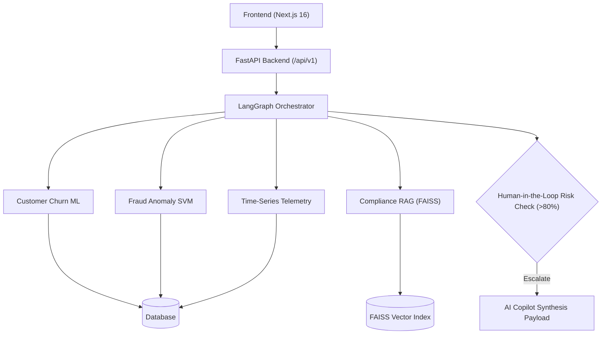

# 🛡️ Aegis — Enterprise AI Banking Intelligence Platform

An autonomous, multi-agent banking risk platform for **Relationship Managers**, **Fraud Investigators**, and **Compliance Officers**.

Aegis combines **LangGraph multi-agent orchestration**, **PyMuPDF + FAISS vector RAG**, and **machine learning telemetry** to detect customer churn, intercept fraud, and automate regulatory compliance.

---

## 🌟 Key Features

- **LangGraph Multi-Agent Engine**: Resilient reasoning pipeline with automated retries, self-correction, and Human-in-the-Loop (HITL) escalation safeguards.
- **PyMuPDF + FAISS Vector RAG**: Native PDF chunking and semantic search across RBI directives and AML SOPs.
- **Machine Learning Models**: Random Forest churn prediction and Isolation Forest / SVM fraud anomaly detection.
- **Role-Based Workspaces**: Tailored UI dashboards for Customer Portfolio Telemetry (`/customer`), Fraud Intercepts (`/fraud`), and Regulatory Compliance (`/knowledge`).

---

## 📐 Architecture Diagram



---

## 🚀 Quick Start

### 1. Backend Setup (FastAPI)
```bash
cd backend
python3 -m venv venv
source venv/bin/activate
pip install -r requirements.txt
uvicorn app.main:app --port 8000 --reload
```

### 2. Frontend Setup (Next.js)
```bash
cd frontend
npm install
npm run dev
```
Open **http://localhost:3000** in your browser.

---

## 🔐 Database Login Credentials

| Email | Password | Role |
| :--- | :--- | :--- |
| `rm@aegis.com` | `password123` | **Relationship Manager** |
| `analyst@aegis.com` | `password123` | **Fraud Analyst** |
| `admin@aegis.com` | `password123` | **Super Admin** |