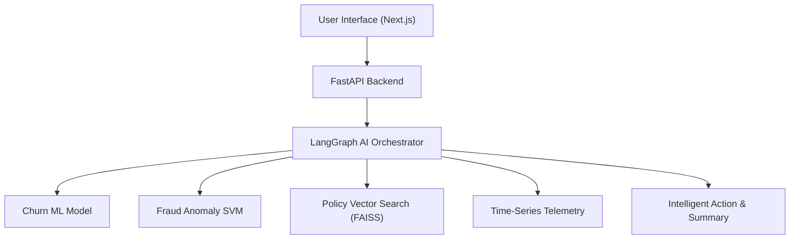

# 🛡️ Aegis — Banking Intelligence Platform

## 📌 What is this Project?
**Aegis** is an AI-powered banking intelligence platform built for Relationship Managers, Fraud Analysts, and Compliance Officers. 

It acts as an autonomous co-pilot that continuously monitors customer accounts, predicts when clients might leave the bank, intercepts fraudulent wire transfers, and answers complex regulatory compliance questions using specialized AI agents.

---

## ✨ Core Features & Technologies

### 1. 🤖 Machine Learning Models (Churn & Fraud)
- **Churn Prediction ML Model**: Machine Learning model (Random Forest & Heuristic Telemetry) that calculates client attrition risk (e.g., predicting Maya Iyer's 92% churn probability) and prescribes targeted retention offers.
- **Fraud Anomaly SVM Model**: Anomaly detection model (Isolation Forest / One-Class SVM) that intercepts high-risk transactions (such as ₹4.2L wires via Dubai Tor exit nodes or ₹1.25 Cr SWIFT transfers to Cayman Islands).

### 2. 📚 Regulatory Vector RAG (Retrieval-Augmented Generation)
- **PyMuPDF + FAISS Vector Search**: Converts banking SOPs, RBI master directives, and AML policies into vector embeddings using `SentenceTransformer (all-MiniLM-L6-v2)`.
- **Instant Compliance Answers**: Retrieves exact policy clauses and alerts RMs to 24-hour mandatory FIU-IND Suspicious Activity Report (SAR) disclosure windows.

### 3. 🧠 Multi-Agent Orchestration (LangGraph Agents)
- **Stateful Agent Workflows**: Coordinates specialized AI tools (Churn ML, Fraud SVM, Regulatory RAG, Time-Series) to synthesize unified cross-domain intelligence reports.
- **Self-Correction & Retries**: Automated retry loops when tools fail.
- **Human-in-the-Loop (HITL) Guardrails**: Pauses high-impact financial actions (wire fee waivers, SWIFT unfreezes) for explicit approval from a Senior Relationship Manager or Compliance Officer.

### 4. 📈 Event-Correlated Time-Series Analytics
- **12-Month Telemetry Checkpoints**: Tracks portfolio AUM and net deposit drain across 8 checkpoints.
- **Macro Event Correlation**: Directly correlates fund movements with real-world triggers (RBI +50bps rate hikes, competitor 8.25% FD campaigns, and unresolved support ticket friction).

---

## 🏗️ Technology Architecture

- **Frontend**: Next.js 16 (React 19) + Tailwind CSS v4 (supports Light & Dark Mode).
- **Backend**: FastAPI (Python 3.12) + SQLite / PostgreSQL.
- **AI & ML Engine**: LangGraph Agents, FAISS Vector Index, PyMuPDF, Scikit-Learn.



---

## 🚀 How to Use & Run

### 1. Run the Backend
```bash
cd backend
python3 -m venv venv
source venv/bin/activate
pip install -r requirements.txt
uvicorn app.main:app --port 8000 --reload
```

### 2. Run the Frontend
```bash
cd frontend
npm install
npm run dev
```
Open **http://localhost:3000** in your web browser.

---

## 🔑 Login Accounts

| Email | Password | Role Persona |
| :--- | :--- | :--- |
| `rm@aegis.com` | `password123` | **Relationship Manager** |
| `analyst@aegis.com` | `password123` | **Fraud Analyst** |
| `admin@aegis.com` | `password123` | **Super Admin** |