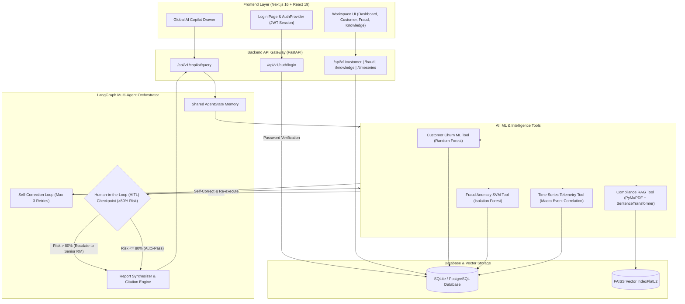

# 🛡️ Aegis — Banking Intelligence Platform

## 📌 What is this Project?
**Aegis** is an AI-powered banking intelligence platform built for Relationship Managers, Fraud Analysts, and Compliance Officers. 

It acts as an autonomous co-pilot that continuously monitors customer accounts, predicts when clients might leave the bank, intercepts fraudulent wire transfers, and answers complex regulatory compliance questions using specialized AI agents.

---

## ✨ Core Features & Technologies

### 1. 🤖 Machine Learning Models (Churn & Fraud)
- **Churn Prediction ML Model**: Machine Learning model (Random Forest & Heuristic Telemetry) that calculates client attrition risk (e.g., predicting Maya Iyer's 92% churn probability) and prescribes targeted retention offers.
- **Fraud Anomaly SVM Model**: Anomaly detection model (Isolation Forest / One-Class SVM) that intercepts high-risk transactions (such as ₹4.2L wires via Dubai Tor exit nodes or ₹1.25 Cr SWIFT transfers to Cayman Islands).

### 2. 📚 Regulatory Vector RAG (Retrieval-Augmented Generation)
- **PyMuPDF + FAISS Vector Search**: Converts banking SOPs, RBI master directives, and AML policies into vector embeddings using `SentenceTransformer (all-MiniLM-L6-v2)`.
- **Instant Compliance Answers**: Retrieves exact policy clauses and alerts RMs to 24-hour mandatory FIU-IND Suspicious Activity Report (SAR) disclosure windows.

### 3. 🧠 Multi-Agent Orchestration (LangGraph Agents)
- **Stateful Agent Workflows**: Coordinates specialized AI tools (Churn ML, Fraud SVM, Regulatory RAG, Time-Series) to synthesize unified cross-domain intelligence reports.
- **Self-Correction & Retries**: Automated retry loops when tools fail.
- **Human-in-the-Loop (HITL) Guardrails**: Pauses high-impact financial actions (wire fee waivers, SWIFT unfreezes) for explicit approval from a Senior Relationship Manager or Compliance Officer.

### 4. 📈 Event-Correlated Time-Series Analytics
- **12-Month Telemetry Checkpoints**: Tracks portfolio AUM and net deposit drain across 8 checkpoints.
- **Macro Event Correlation**: Directly correlates fund movements with real-world triggers (RBI +50bps rate hikes, competitor 8.25% FD campaigns, and unresolved support ticket friction).

---

## 🏗️ Technology Architecture



---

## 📁 Project Folder Structure

```
banking-intelligence-platform/
├── backend/
│   ├── app/
│   │   ├── api/
│   │   │   └── v1/
│   │   │       ├── auth.py               # Authentication & user role session endpoints
│   │   │       ├── copilot.py            # LangGraph multi-agent copilot API route
│   │   │       ├── customer.py           # Client profile & churn intelligence API
│   │   │       ├── fraud.py              # Transaction interception & fraud workstation API
│   │   │       ├── knowledge.py          # PDF RAG upload & FAISS vector search API
│   │   │       └── timeseries.py         # Portfolio AUM telemetry & macro correlation API
│   │   ├── agents/
│   │   │   ├── langgraph_orchestrator.py # Stateful LangGraph Multi-Agent Orchestrator
│   │   │   └── tools/
│   │   │       ├── customer_tool.py      # User's Random Forest Churn ML tool
│   │   │       ├── fraud_tool.py         # User's One-Class SVM Fraud anomaly tool
│   │   │       ├── compliance_tool.py    # PyMuPDF + SentenceTransformer FAISS RAG tool
│   │   │       └── timeseries_tool.py    # Telemetry & macro event correlation tool
│   │   ├── core/
│   │   │   ├── config.py                 # System configuration & CORS settings
│   │   │   └── security.py               # SHA-256 password hashing & JWT auth tokens
│   │   ├── db/
│   │   │   ├── init_db.py                # Database initializer & mock data seeder
│   │   │   ├── models.py                 # SQLAlchemy ORM models (User, Customer, FraudAlert)
│   │   │   └── session.py                # PostgreSQL 15 & SQLite fallback database engine
│   │   ├── ml/
│   │   │   ├── churn_model.pkl           # User's trained Churn model
│   │   │   ├── encoders.pkl              # Feature label encoders
│   │   │   ├── scaler.pkl                # Feature standard scaler
│   │   │   └── svm_model.pkl             # User's trained Fraud SVM model
│   │   ├── schemas/                      # Pydantic schemas for data validation
│   │   └── main.py                       # FastAPI server entry point
│   ├── .env                              # Environment configuration (GEMINI_API_KEY)
│   └── requirements.txt                  # Python dependencies
└── frontend/
    ├── src/
    │   ├── app/                          # Next.js 16 App Router pages
    │   │   ├── (auth)/login/             # Sign-in authentication page
    │   │   ├── customer/                 # Customer Intelligence workstation
    │   │   ├── dashboard/                # Executive Risk Overview dashboard
    │   │   ├── fraud/                    # Fraud Interception workstation
    │   │   ├── knowledge/                # Policy RAG & drag-and-drop PDF upload page
    │   │   ├── settings/                 # System security & RBAC settings
    │   │   ├── globals.css               # Design system CSS variables & tokens
    │   │   ├── layout.tsx                # Root layout wrapper
    │   │   └── page.tsx                  # Interactive landing page
    │   ├── components/
    │   │   ├── common/                   # Shared UI (Modals, Action Buttons, Markdown)
    │   │   ├── customer/                 # Customer profile & churn components
    │   │   ├── dashboard/                # Executive KPI grid, charts, AI briefings
    │   │   ├── fraud/                    # Interception tables, rule configs, telemetry
    │   │   ├── knowledge/                # Document viewer, PDF modal, search
    │   │   └── layout/                   # Sidebar, TopNavbar, AppLayout
    │   ├── providers/                    # AuthProvider & ThemeProvider contexts
    │   └── services/
    │       └── api.ts                    # Axios API service client
    └── package.json                      # Frontend Node.js dependencies
```

---

## 🚀 How to Use & Run

### 1. Run the Backend
```bash
cd backend
python3 -m venv venv
source venv/bin/activate
pip install -r requirements.txt
uvicorn app.main:app --port 8000 --reload
```

### 2. Run the Frontend
```bash
cd frontend
npm install
npm run dev
```
Open **http://localhost:3000** in your web browser.

---

## 🔑 Login Accounts

| Email | Password | Role Persona |
| :--- | :--- | :--- |
| `rm@aegis.com` | `password123` | **Relationship Manager** |
| `analyst@aegis.com` | `password123` | **Fraud Analyst** |
| `admin@aegis.com` | `password123` | **Super Admin** |