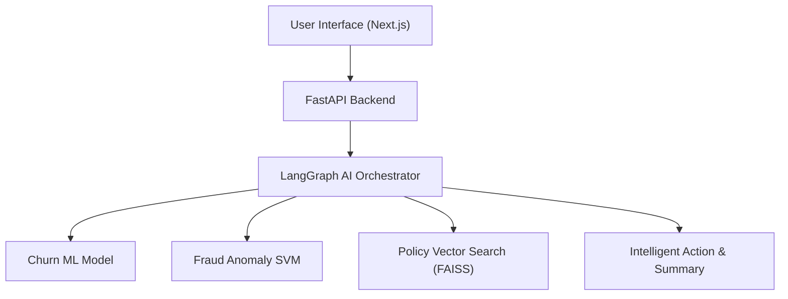

# 🛡️ Aegis — Banking Intelligence Platform

## 📌 What is this Project?
**Aegis** is an AI-powered banking intelligence platform built for Relationship Managers, Fraud Analysts, and Compliance Officers. 

It acts as an autonomous co-pilot that continuously monitors customer accounts, predicts when clients might leave the bank (churn), intercepts fraudulent wire transfers, and answers complex regulatory compliance questions using custom AI agents.

---

## ✨ Features & Uses

### 1. 👥 Customer Retention & Churn Prediction
- **Predicts Attrition Risk**: Uses Machine Learning to spot clients at risk of closing their accounts (like predicting Maya Iyer's 92% churn risk).
- **Identifies Root Causes**: Pinpoints why funds are draining (e.g. RBI rate hikes, wire fee disputes).
- **Recommends RM Actions**: Suggests concrete retention offers, such as waiving disputed fees or offering rate bonuses.

### 2. 🚨 Real-Time Fraud Intercept
- **Detects Anomalies**: Flags suspicious transactions (e.g., unauthorized ₹1.25 Cr SWIFT transfers to Cayman Islands or Tor exit node IP routing in Dubai).
- **Visualizes Network Hops**: Displays an interactive 5-step transaction flow mapping Customer $\rightarrow$ Instrument $\rightarrow$ Merchant $\rightarrow$ Device $\rightarrow$ Location.

### 3. 📚 Regulatory SOP & Policy Search (RAG)
- **Instant Search**: Search banking guidelines, RBI directives, and AML policies in natural language.
- **Automated Filing Alerts**: Flags 24-hour mandatory Suspicious Activity Report (SAR) disclosure deadlines.

### 4. 🤖 Cross-Domain AI Copilot
- **Ask AI Anything**: A floating assistant that combines data across customer portfolios, fraud alerts, and compliance policies in one response.
- **Human-in-the-Loop Safeguards**: Pauses risky automated actions until approved by a manager.

---

## 🏗️ Technology Architecture

- **Frontend**: Next.js 16 (React 19) + Tailwind CSS v4 (supports Light & Dark Mode).
- **Backend**: FastAPI (Python 3.12) + SQLite / PostgreSQL.
- **AI & ML Engine**:
  - **LangGraph**: Orchestrates AI agents with automatic retries and guardrails.
  - **FAISS & SentenceTransformers**: Vector search for PDF regulatory search.
  - **Scikit-Learn**: Machine learning models for churn prediction and fraud detection.



---

## 🚀 How to Use & Run

### 1. Run the Backend
```bash
cd backend
python3 -m venv venv
source venv/bin/activate
pip install -r requirements.txt
uvicorn app.main:app --port 8000 --reload
```

### 2. Run the Frontend
```bash
cd frontend
npm install
npm run dev
```
Open **http://localhost:3000** in your web browser.

---

## 🔑 Login Accounts

| Email | Password | Role Persona |
| :--- | :--- | :--- |
| `rm@aegis.com` | `password123` | **Relationship Manager** |
| `analyst@aegis.com` | `password123` | **Fraud Analyst** |
| `admin@aegis.com` | `password123` | **Super Admin** |