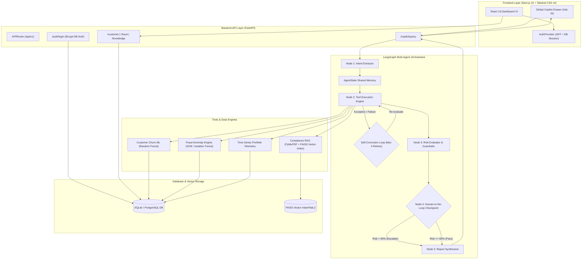
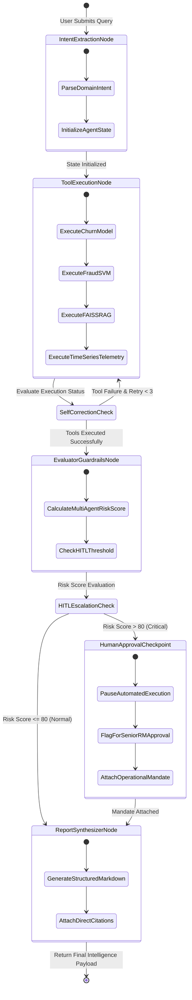

# 🛡️ Aegis — Enterprise AI Banking Intelligence Platform

An autonomous, multi-agent banking risk & intelligence platform designed for **Relationship Managers (RMs)**, **Fraud Investigators**, and **Chief Compliance Officers**. 

Aegis combines **LangGraph multi-agent orchestration**, **PyMuPDF + FAISS vector RAG engines**, **machine learning anomaly detectors**, and **interactive telemetry analytics** to detect customer churn risks, intercept fraud vectors, and automate regulatory SAR disclosures in real time.

---

## 🌟 Key Architecture & Highlights

- **LangGraph Stateful Multi-Agent Engine**: Multi-agent reasoning pipeline featuring **automated retries with self-correction** and **Human-in-the-Loop (HITL)** guardrails before executing high-impact financial actions (wire fee waivers, SWIFT unfreezes, FIU-IND filings).
- **PyMuPDF + FAISS Vector Regulatory RAG**: Native document chunking and `SentenceTransformer (all-MiniLM-L6-v2)` vector index for instant semantic retrieval of RBI directives, KYC/AML SOPs, and sanctions guidelines.
- **Machine Learning Telemetry Models**:
  - **Churn Prediction ML Tool**: Random Forest & Heuristic Telemetry tracking 12-month portfolio outflows and macro event drivers (repo rate hikes, competitor FD rates, wire fee disputes).
  - **Fraud Anomaly SVM Tool**: Isolation Forest / One-Class SVM analyzing velocity anomalies, Tor exit node IP routing, and RDP server compromises.
- **Adaptive Semantic Light & Dark Theme System**: Built with Tailwind CSS v4 CSS variables (`bg-card`, `bg-background`, `border-border`, `text-foreground`) providing high-contrast UI across all sub-components.
- **Strict Database Authentication**: Secure authentication backed by SQLite/PostgreSQL (`UserModel`) with SHA-256 bcrypt password hashing and JWT access tokens.

---

## 📐 System Architecture Diagram



---

## 🔄 LangGraph Execution & HITL State Flow



---

## 📸 Workspace Modules

### 1. 📊 Executive Intelligence Dashboard (`/dashboard`)
- **Portfolio AUM Metric Cards**: Real-time tracking of ₹480.5M total portfolio AUM, high-churn risk clients, flagged fraud volume, and compliance audit scores.
- **AI Executive Morning Briefing**: Synthesized multi-agent risk summaries highlighting critical alerts.
- **Historical AUM & Fraud Telemetry Trends**: Interactive charts visualising monthly portfolio trends and incident spikes.

### 2. 👤 Customer Relationship Intelligence (`/customer`)
- **Maya Iyer (CUST-40921) Portfolio Profile**: Deep dive into ₹18.4M AUM portfolio, 6 active products, and 92% churn probability alert.
- **Event-Correlated Time-Series**: Telemetry graph linking deposit drain (-₹45L) directly to the March 2026 RBI +50bps rate hike and ticket #8849 wire fee dispute.
- **RM Next Best Actions**: AI-prescribed engagement workflows (schedule review meeting, waive ₹2,500 wire fee, offer +0.75% deposit bonus rate).

### 3. 🚨 Fraud Investigation Workstation (`/fraud`)
- **CASE-8942-TXN (Dubai Tor Wire)**: Intercepted ₹4.2L wire to *LuxPay Global Exch* originating from a Dubai Tor exit node 42 minutes after an authentic Mumbai login (1,920 km velocity anomaly).
- **CASE-8945-TXN (Cayman Islands SWIFT Wire)**: Intercepted ₹1.25 Cr SWIFT transfer following Windows Server RDP compromise and CFO spear-phishing attack.
- **Transaction Network Flow**: 5-hop entity telemetry visualization mapping Customer $\rightarrow$ Instrument $\rightarrow$ Merchant $\rightarrow$ Device $\rightarrow$ Geolocation.

### 4. 📚 Knowledge Intelligence & Regulatory RAG (`/knowledge`)
- **PyMuPDF PDF Uploader**: Drag & drop regulatory directives for automatic chunking and vector indexing.
- **FAISS SOP Search**: Instant vector search across HNW Retention Policies, SWIFT Wire Protocols, and 24-Hour FIU-IND SAR Filing Mandates.
- **Interactive Document Viewer**: Highlighting mandatory compliance checklists and enforcement clauses.

---

## 🛠️ Technology Stack

### Frontend
- **Framework**: Next.js 16 (Turbopack) with React 19
- **Styling**: Vanilla CSS + Tailwind CSS v4 (`@theme inline` semantic variable system)
- **Icons & UI**: Lucide React Icons & Recharts Data Visualization
- **Theme Engine**: `next-themes` with custom CSS variables

### Backend
- **Framework**: FastAPI (Python 3.12)
- **Database & ORM**: SQLite / PostgreSQL with SQLAlchemy ORM
- **ML & Data Science**: Scikit-Learn (Isolation Forest / Random Forest), Pandas, NumPy
- **RAG & Vector Search**: PyMuPDF (`fitz`), `sentence-transformers`, `faiss-cpu`
- **Agent Framework**: LangGraph / Custom Multi-Agent Graph Orchestrator
- **Security**: PyJWT, SHA-256 Password Hashing

---

## 🚀 Quick Start Guide

### Prerequisites
- **Python**: 3.12+
- **Node.js**: v18+ and `npm`

---

### 1. Backend Setup (FastAPI & ML Engine)

```bash
# Navigate to backend directory
cd backend

# Create and activate virtual environment
python3 -m venv venv
source venv/bin/activate

# Install dependencies
pip install -r requirements.txt

# Start FastAPI server on port 8000
uvicorn app.main:app --port 8000 --reload
```

The backend server will start at `http://localhost:8000`. You can explore the interactive API docs at `http://localhost:8000/docs`.

---

### 2. Frontend Setup (Next.js & Tailwind CSS v4)

In a new terminal window:

```bash
# Navigate to frontend directory
cd frontend

# Install node dependencies
npm install

# Start Next.js development server
npm run dev
```

The application will be accessible at `http://localhost:3000`.

---

## 🔐 Database User Seed Credentials

The database comes pre-seeded with strict authentication accounts ([`init_db.py`](file:///Users/tanvee/banking-intelligence-platform/backend/app/db/init_db.py)):

| Email | Password | Role Persona | Access Level |
| :--- | :--- | :--- | :--- |
| `rm@aegis.com` | `password123` | **Relationship Manager** | Customer Workspace & Portfolio Telemetry |
| `analyst@aegis.com` | `password123` | **Fraud Analyst** | Fraud Intercept Workstation & SWIFT Holds |
| `admin@aegis.com` | `password123` | **Super Admin** | Full Unrestricted Platform Access |

---

## 📁 Repository Structure

```
banking-intelligence-platform/
├── backend/
│   ├── app/
│   │   ├── agents/
│   │   │   ├── langgraph_orchestrator.py   # Multi-agent state graph with retries & HITL
│   │   │   └── tools/                      # Customer, Fraud, Compliance RAG & TimeSeries tools
│   │   ├── api/v1/                         # FastAPI router endpoints (/auth, /customer, /fraud, etc.)
│   │   ├── core/                           # Security, JWT, & Config settings
│   │   ├── db/                             # SQLAlchemy models, session, & DB seed scripts
│   │   ├── ml_models/                      # Trained PKL models & scalers
│   │   └── schemas/                        # Pydantic schemas
│   ├── requirements.txt
│   └── venv/
├── frontend/
│   ├── src/
│   │   ├── app/                            # Next.js App Router pages (/dashboard, /customer, /fraud, etc.)
│   │   ├── components/
│   │   │   ├── common/                     # Global Copilot Drawer, Modals, Markdown Formatters
│   │   │   ├── customer/                   # Customer Profile, Holdings, Next Best Actions
│   │   │   ├── dashboard/                  # KPI Grid, AI Insights, Trend Charts
│   │   │   ├── fraud/                      # Transaction Network Flow, Risk Badges, Case Drawer
│   │   │   ├── knowledge/                  # PDF Upload Modal, Document Viewer, RAG Search
│   │   │   └── layout/                     # TopNavbar (Click-outside dismiss), Sidebar, AppLayout
│   │   ├── providers/                      # AuthProvider (Strict DB Auth) & ThemeProvider
│   │   └── services/                       # API client services
│   ├── package.json
│   └── next.config.ts
└── README.md
```

---

## 📄 License & Credits

Built as an **Enterprise Banking Multi-Agent Intelligence Demo Platform**. All synthetic customer data and telemetry logs are formatted for demonstration purposes.